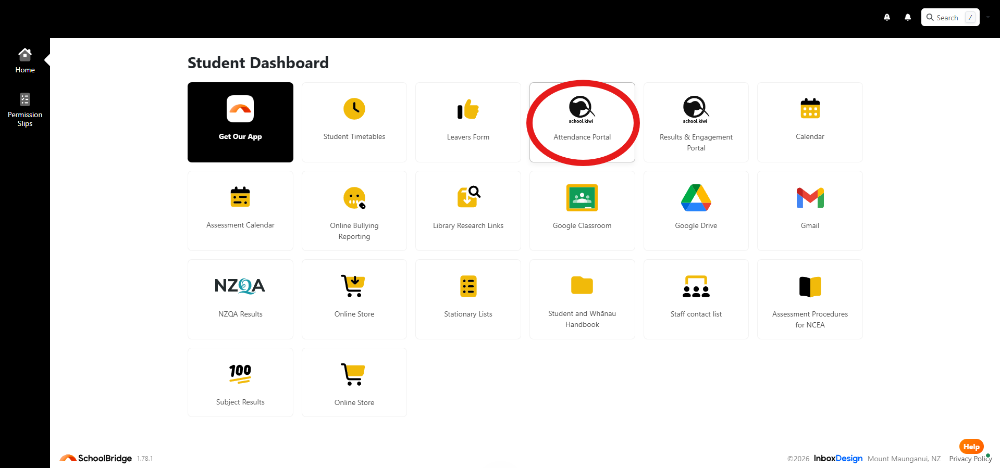
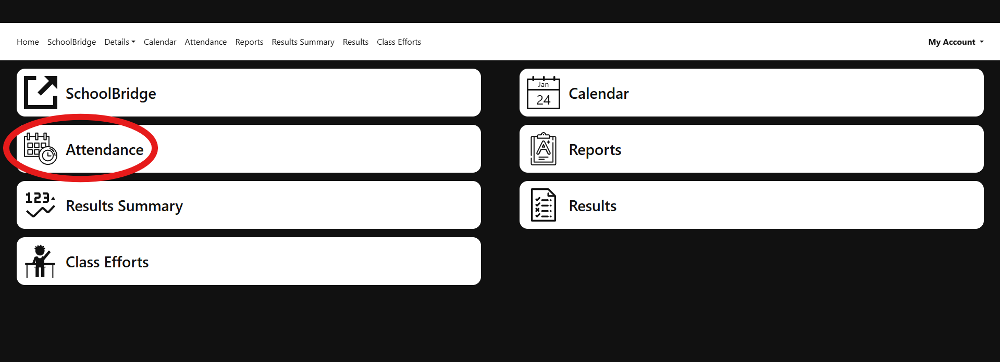

# Teacher Viewer
This was made mostly with AI, to help others figure out their teachers.

# How to view your timetable:
1. Open your attendance on SchoolBridge:

   
   
   
   
2. Navigate below your timetable to where it says **"Enter this URL into iCal, Google Calendar, Outlook:"** and click on the link.
   
3. You have now downloaded your ICS file. Upload it to the Teacher Viewer site (no data is stored).
